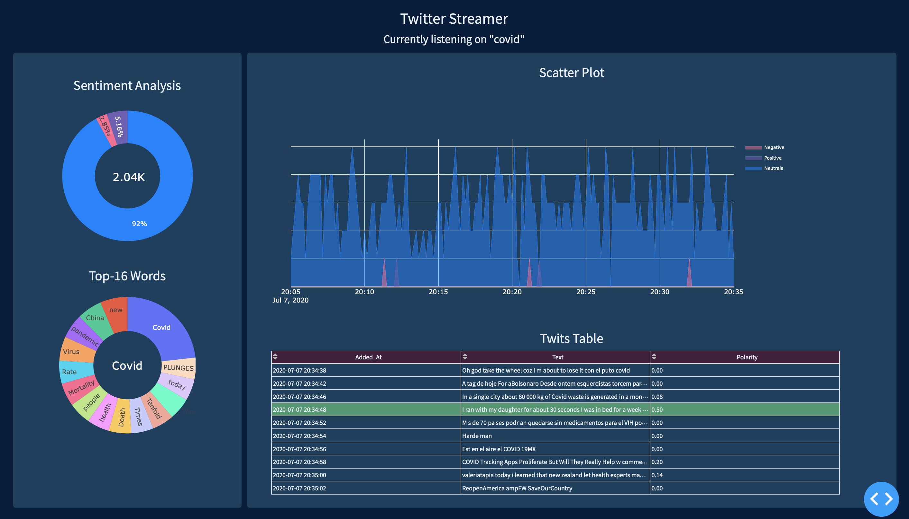

# Live_stream_twitter

In order to reproduce the Live Stream Dashboard, you should launch data collection process in background. You launch data collection mannualy. Then run app.py.

If you want to make your own database, you can use df_setup.py or use my own, but it listened on 'covid'.

If you want changed listening words, follow to settings.py and setup your wants.

Further study:

1) NLP improvements
2) Deployment to server
3) Database deployment
4) etc.
